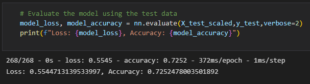
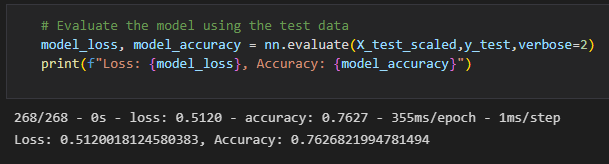

# Neural_Network_Charity_Analysis

## Overview

This project requires the use of Neural Networks Machine Learning algorithms.  To code the files needed to make this model, I am using Python TensorFlow library in order to create a binary classifier that is capable of predicting whether applicants will be successful if funded by nonprofit foundation Alphabet Soup. 

## Results

## Summary

### Data Preprocessing

1. What variable(s) are considered the target(s) for your model?

- The “IS_SUCCESSFULL” column is the target variable.

2. What variable(s) are considered to be the features for your model?

- The independant values (all columns, except target variable and any dropped columns).

3. What variable(s) are neither targets nor features, and should be removed from the input data?

- The variables that should be removed and are neither targets nor features are variables that do not add value to our analysis. One example would be variables with all unique values. Another thing to keep in mind is to take care of the Noisy data and outliers.

### Compiling, Training, and Evaluating the Model

4. How many neurons, layers, and activation functions did you select for your neural network model, and why?

- Only two layers were needed for this model, adding a third layer did not increase performance. 

- I used relu activation function, since it has best accuracy for this model.

- I used 200 neurons for first layer and 90 neurons for second layer. As recommended first layer should have at least double the amount of input features, that is 100 input values (rows) in our case.

- The Adam optimizer was used to improve classifying variables and features in an effort to enhance the performance of classification within the neural network.

- The model still trained at 100 epochs and improved by 3.74%.

5. Were you able to achieve the target model performance?

- Yes. I achieved the target model performance. The model accuracy improved to 76.26% after optimization.

6. What steps did you take to try and increase model performance?

- Checked input data and brought back NAME column, that was initially skipped. I set a condition on the values that are less than 50 in “Other” group. That reduced the number of unique categorical values by binning the values.
- Binned the ASK_AMT values.
